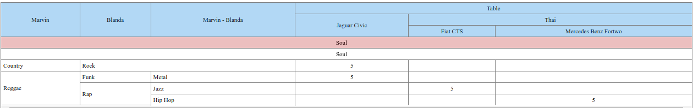

# Многоуровневая таблица
Построение многоуровневых таблиц на javascript

- фиксированая шапка таблицы
- фиксированные столбцы
- набор дефолтных цветов столбцов/строк
- строки-разделители
- возможность добавления класса к строке или столбцу (для кастомизации UI)
- выравнивание заголовков строк
- подсветка столбцов и строк при наведении

Данные таблицы представлены в виде иерархической структуры столбцов и строк

Максимальная вложенность столбов должна соответствовать максимальной вложенности данных



## Установка и подключение
`npm i @anikin/table`

```javascript
//app.js
window.Table = require('@anikin/table').default;
```

## Конфигурация столбцов
Конфигурация столбцов описывается в иерархической структуре

Столбцы которые не имеют ключ `code` заполняются значениями из `title` из `data`. Если в `data` не заполнены все уровне вложенности - эти ячейки обьядиняются.   

```javascript
const сolumns = [
    {
        title: 'Marvin - Blanda'
    },
    {
        title: 'Table',
        children: [
            {
                title: 'Jaguar Civic',
                code: 'code1'
            },
            {
                title: 'Thai',
                children: [
                    {
                        title: 'Fiat CTS',
                        code: 'code2'
                    },
                    {
                        title: 'Mercedes Benz Fortwo',
                        code: 'code3'
                    },
                ]
            }
        ]
    },
];
```

Для каждого столбцы можно указать `color: 'green' | 'blue' | 'red' | 'orange' | string` и `className`

## Конфигурация данных

```javascript
const data = [
    // строка-разделитель фиксированная
    {
        title: 'Soul',
        color: 'red'
    },
    // строка-разделитель прокручивающаеся
    {
        title: 'Soul',
        sticky: false
    },
    {
        title: 'Country',
        children: [
            // строка c данными
            {
                title: 'Rock',
                values: {
                    code1: 5
                }
            }
        ],
        title: 'Reggae',
        children: [
            {
                title: 'Funk',
                children: [
                    {
                        // строка c данными
                        title: 'Metal',
                        values: {
                            code1: 5
                        }
                    }
                ]
            },

            {
                title: 'Rap',
                children: [
                    {
                        // строка c данными
                        title: 'Jazz',
                        values: {
                            code2: 5
                        }
                    },
                    {
                        // строка c данными
                        title: 'Hip Hop',
                        values: {
                            code3: 5
                        }
                    }                    
                ]
            }
        ]
    }
]
```

Для каждого столбцы можно указать `color: 'green' | 'blue' | 'red' | 'orange' | string`, `bold` и `className`


## Пример использования

```javascript
new Table({
    columns: columns,
    data: data,
    root: document.getElementById('root'),
    fullHeight: true,
    headerColor: 'blue'
})
```

- `root` - корневой элемент в котором отобразить таблицу 
- `fullHeight` - заолняет все свободное пространство ниже элемента  `root`
- `headerColor` - 'green' | 'blue' | 'red' | 'orange' | string